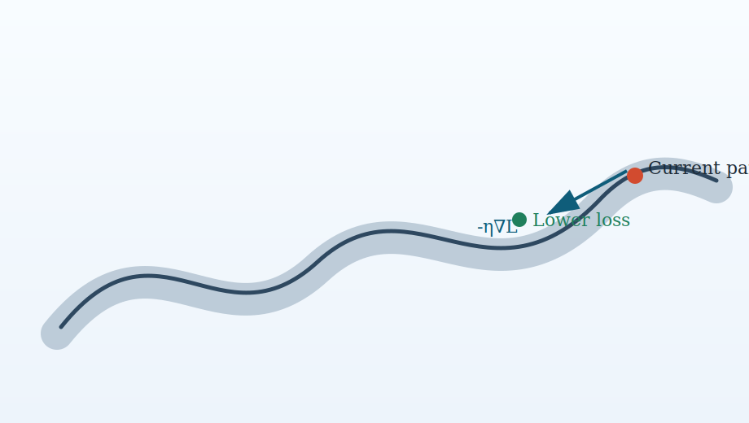

## Core question

What are the minimum mathematical and computational concepts needed to understand modern deep learning systems?[^need]

## Key ideas

- Vectors and matrices represent data and parameters.
- Differentiable objectives define learning targets.
- Computation graphs organize forward and backward passes.

## Example

We use a simple linear function:

$$
y = \mathbf{w}^T \mathbf{x} + b
$$

This appears repeatedly in deeper models as a local building block.

## Training geometry

As shown in @fig-training-surface, optimizing parameters is equivalent to moving on a loss surface.

{#fig-training-surface fig-alt="Toy loss surface with a descending direction"}

## Summary

Foundations create a shared language for all later chapters.

[^need]: In practice, this baseline includes linear algebra, derivatives, and optimization intuition.
